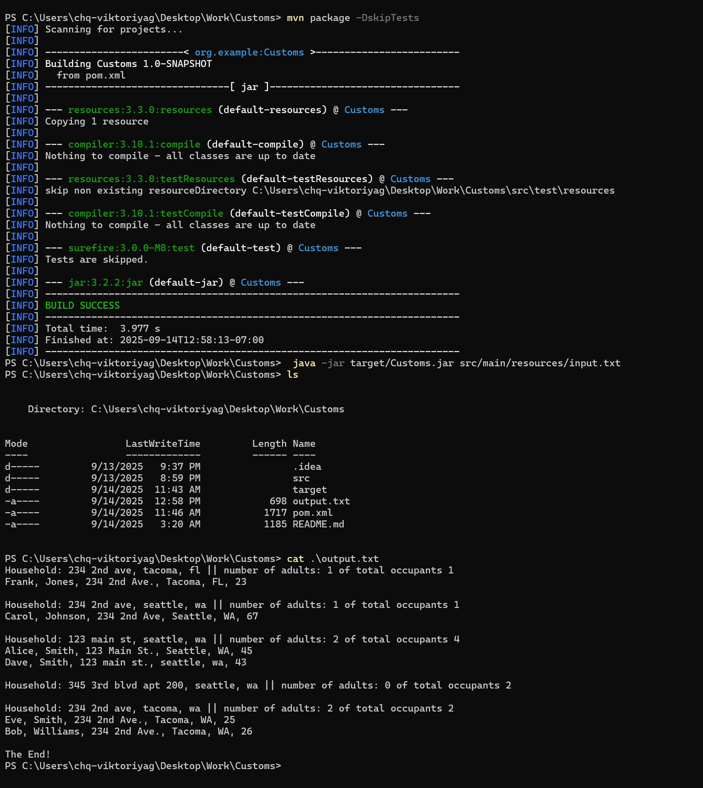

The application reads input from the input.txt file and stores the data in a Map-based database, where the key is an address and the value is a List of objects. Each object contains information about a person: first name, last name, address, and age. The application checks if a person with the same first name, last name, and age already exists in the database. If the person exists, the application avoids adding a duplicate entry. After populating the database, the application applies a filter to display each household along with the number of occupants. It then lists each occupant's first name, last name, address, and age, sorted by last name then first name, including only those who are older than 18.

Run the application (assuming java is installed):

In terminal cd to the project
Populate input.txt file with data

Run using a command: 'mvn exec':
mvn exec:java -DargFromCommandLine="src/main/resources/input.txt"
mvn exec:java -DargFromCommandLine="src/test/java/test_input.txt"

Run a test:

java src/test/java/FileComparatorTest.java src/test/java/test_output.txt output.txt

